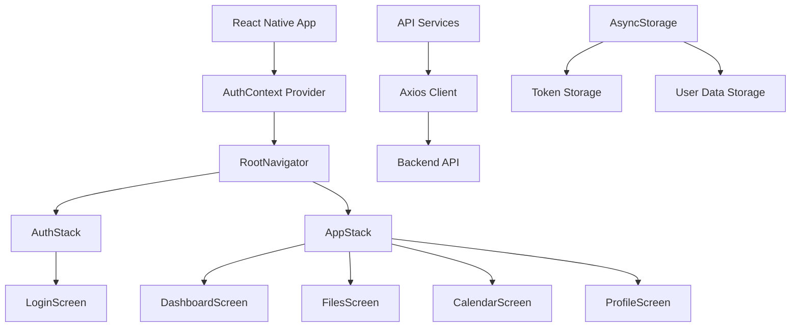

# UTVstay Mobile App - Guía de Instalación y Configuración Técnica

## 📋 Descripción Técnica del Proyecto

UTVstay Mobile App es una aplicación móvil desarrollada con **React Native Expo** y **TypeScript** que proporciona acceso exclusivo a estudiantes del sistema de gestión de documentos de estadías UTVstay. La aplicación implementa una arquitectura basada en Context API para gestión de estado y React Navigation para el enrutamiento.

### Stack Tecnológico

- **Framework**: React Native 0.79.6 con Expo SDK 53
- **Lenguaje**: TypeScript 5.8.3
- **Navegación**: React Navigation v7 (Stack Navigator)
- **Gestión de Estado**: Context API (AuthContext)
- **Almacenamiento Local**: AsyncStorage
- **HTTP Client**: Axios 1.11.0
- **UI Components**: React Native Paper 5.14.5
- **Plantilla Base**: Expo Blank TypeScript

### Arquitectura del Sistema



## 🔧 Requisitos del Sistema

### Herramientas de Desarrollo Requeridas

- **Node.js**: >= 18.0.0 (Recomendado: 22.18.0)
- **npm**: >= 8.0.0 o **yarn**: >= 1.22.0
- **Expo CLI**: >= 6.0.0
- **Git**: >= 2.30.0

### Entorno de Desarrollo Móvil

#### Para Android:
- **Android Studio**: Última versión estable
- **Android SDK**: API Level 33 o superior
- **Java Development Kit (JDK)**: 11 o superior

#### Para iOS (Solo macOS):
- **Xcode**: 14.0 o superior
- **iOS Simulator**: iOS 13.0 o superior
- **CocoaPods**: >= 1.11.0

### Dispositivos de Prueba

- **Android**: API Level 21 (Android 5.0) o superior
- **iOS**: iOS 13.0 o superior
- **Expo Go App**: Para testing en dispositivos físicos

## 🚀 Instalación Paso a Paso

### 1. Clonar el Repositorio

```bash
git clone https://github.com/tu-organizacion/utvstay-mobile-app.git
cd utvstay-mobile-app
```

### 2. Instalación de Dependencias

```bash
# Instalar dependencias del proyecto
npm install

# O usando yarn
yarn install
```

### 3. Verificar Instalación de Expo CLI

```bash
# Instalar Expo CLI globalmente si no está instalado
npm install -g @expo/cli

# Verificar instalación
expo --version
```

### 4. Configuración de Variables de Entorno

Crear archivo `.env` en la raíz del proyecto:

```bash
# .env
API_BASE_URL=https://tu-backend-api.com/api
API_TIMEOUT=10000
ENVIRONMENT=development
```

### 5. Configuración del Cliente API

Editar `src/services/api.ts` con la URL correcta del backend:

```typescript
const API_BASE_URL = process.env.API_BASE_URL || "https://tu-dominio.com/api";
```

## 🛠️ Scripts Disponibles

### Scripts de Desarrollo

```bash
# Iniciar servidor de desarrollo
npm start
# o
expo start

# Iniciar en Android
npm run android
# o
expo start --android

# Iniciar en iOS (solo macOS)
npm run ios
# o
expo start --ios

# Iniciar en web
npm run web
# o
expo start --web
```

### Scripts de Build

```bash
# Build local para Android (APK)
eas build --platform android --profile local

# Build de preview
eas build --platform android --profile preview

# Build de producción
eas build --platform android --profile production

# Build para iOS (requiere cuenta de desarrollador)
eas build --platform ios --profile production
```

### Scripts de Utilidad

```bash
# Limpiar cache de Expo
expo start --clear

# Verificar dependencias
npx expo doctor

# Actualizar Expo SDK
npx expo upgrade
```

## 📁 Estructura del Proyecto

```
utvstay-mobile-app/
├── .expo/                     # Configuración de Expo
├── .vscode/                   # Configuración de VS Code
├── assets/                    # Recursos estáticos
│   ├── img/                   # Imágenes del proyecto
│   ├── icon.png              # Icono de la app
│   └── splash-icon.png       # Splash screen
├── src/                      # Código fuente principal
│   ├── components/           # Componentes reutilizables
│   │   ├── common/          # Componentes comunes
│   │   └── ui/              # Componentes de UI
│   ├── const/               # Constantes del proyecto
│   ├── context/             # Context providers
│   │   └── AuthContext.tsx  # Contexto de autenticación
│   ├── hooks/               # Custom hooks
│   ├── interfaces/          # Definiciones de TypeScript
│   ├── navigation/          # Configuración de navegación
│   │   ├── AppStack.tsx     # Stack de la aplicación
│   │   ├── AuthStack.tsx    # Stack de autenticación
│   │   └── RootNavigator.tsx # Navegador principal
│   ├── screens/             # Pantallas de la aplicación
│   │   ├── app/            # Pantallas principales
│   │   └── auth/           # Pantallas de autenticación
│   ├── services/           # Servicios y APIs
│   └── theme/              # Configuración de tema
├── .gitignore              # Archivos ignorados por Git
├── App.tsx                 # Componente principal
├── app.json               # Configuración de Expo
├── eas.json               # Configuración de EAS Build
├── package.json           # Dependencias y scripts
├── README.md              # Documentación del proyecto
└── tsconfig.json          # Configuración de TypeScript
```

## ⚙️ Configuración del Entorno de Desarrollo

### 1. Configuración de TypeScript

El proyecto utiliza TypeScript con configuración estricta. Archivo `tsconfig.json`:

```json
{
  "extends": "expo/tsconfig.base",
  "compilerOptions": {
    "strict": true,
    "noImplicitReturns": true,
    "noFallthroughCasesInSwitch": true,
    "noUncheckedIndexedAccess": true
  }
}
```

### 2. Configuración de Expo

Archivo `app.json` principal:

```json
{
  "expo": {
    "name": "UTVstay Mobile",
    "slug": "utvstay-mobile",
    "version": "1.0.0",
    "orientation": "portrait",
    "icon": "./assets/icon.png",
    "userInterfaceStyle": "automatic",
    "splash": {
      "image": "./assets/splash-icon.png",
      "resizeMode": "contain",
      "backgroundColor": "#10B981"
    },
    "assetBundlePatterns": ["**/*"],
    "ios": {
      "supportsTablet": true,
      "bundleIdentifier": "com.utvstay.mobile"
    },
    "android": {
      "adaptiveIcon": {
        "foregroundImage": "./assets/adaptive-icon.png",
        "backgroundColor": "#10B981"
      },
      "package": "com.utvstay.mobile"
    }
  }
}
```

### 3. Configuración de EAS Build

Archivo `eas.json` para builds:

```json
{
  "cli": {
    "version": ">= 16.19.3",
    "appVersionSource": "remote"
  },
  "build": {
    "development": {
      "distribution": "internal",
      "android": {
        "buildType": "apk"
      }
    },
    "preview": {
      "distribution": "internal",
      "android": {
        "buildType": "apk"
      }
    },
    "production": {
      "autoIncrement": true,
      "android": {
        "buildType": "aab"
      }
    }
  }
}
```

## 🔐 Configuración de Autenticación

### AuthContext Implementation

```typescript
// src/context/AuthContext.tsx
interface AuthContextType {
  isLoggedIn: boolean;
  user: User | null;
  token: string | null;
  login: (email: string, password: string) => Promise<boolean>;
  logout: () => Promise<void>;
  loading: boolean;
  hasRole: (role: string) => boolean;
}
```

### API Client Configuration

```typescript
// src/services/api.ts
import axios from 'axios';
import AsyncStorage from '@react-native-async-storage/async-storage';

const apiClient = axios.create({
  baseURL: process.env.API_BASE_URL,
  timeout: 10000,
  headers: {
    'Content-Type': 'application/json',
    'Accept': 'application/json',
  },
});

// Request interceptor para agregar token
apiClient.interceptors.request.use(async (config) => {
  const token = await AsyncStorage.getItem('userToken');
  if (token) {
    config.headers.Authorization = `Bearer ${token}`;
  }
  return config;
});

// Response interceptor para manejar errores
apiClient.interceptors.response.use(
  (response) => response,
  async (error) => {
    if (error.response?.status === 401) {
      await AsyncStorage.multiRemove(['userToken', 'userData', 'isLoggedIn']);
      // Trigger logout
    }
    return Promise.reject(error);
  }
);
```

## 🏗️ Configuración de Build

### Desarrollo Local

```bash
# Iniciar servidor de desarrollo
expo start --dev-client

# Build local para testing
eas build --platform android --profile development --local
```

### Build de Producción

```bash
# Configurar credenciales
eas credentials

# Build para Android
eas build --platform android --profile production

# Build para iOS (requiere Apple Developer Account)
eas build --platform ios --profile production
```

### Distribución

```bash
# Submit a Google Play Store
eas submit --platform android

# Submit a App Store
eas submit --platform ios
```

## 🧪 Testing y Debugging

### Herramientas de Debug

```bash
# Flipper (React Native Debugger)
npx react-native log-android
npx react-native log-ios

# Expo DevTools
expo start --dev-client

# Remote debugging
expo start --tunnel
```

### Testing en Dispositivos

```bash
# Instalar Expo Go en dispositivo físico
# Escanear QR code desde expo start

# Testing con build de desarrollo
eas build --platform android --profile development
```

## 🔧 Troubleshooting Técnico

### Problemas Comunes

#### 1. Error de Metro Bundler

```bash
# Limpiar cache
expo start --clear
npx react-native start --reset-cache
```

#### 2. Problemas de Dependencias

```bash
# Reinstalar node_modules
rm -rf node_modules
npm install

# Verificar compatibilidad
npx expo doctor
```

#### 3. Errores de Build

```bash
# Limpiar build cache
eas build --clear-cache

# Verificar configuración
eas build --platform android --profile development --local
```

#### 4. Problemas de AsyncStorage

```bash
# Limpiar storage en desarrollo
# Usar Flipper o React Native Debugger
AsyncStorage.clear()
```

### Logs y Monitoreo

```bash
# Ver logs en tiempo real
expo logs

# Logs específicos de plataforma
adb logcat | grep ReactNativeJS  # Android
xcrun simctl spawn booted log stream --predicate 'eventMessage contains "React"'  # iOS
```

## 📊 Performance y Optimización

### Bundle Analysis

```bash
# Analizar bundle size
npx expo export --dump-sourcemap
npx react-native-bundle-visualizer
```

### Optimizaciones Recomendadas

1. **Lazy Loading**: Implementar carga diferida de pantallas
2. **Image Optimization**: Usar formatos optimizados (WebP)
3. **Bundle Splitting**: Separar código por funcionalidad
4. **Memory Management**: Limpiar listeners y subscripciones

## 🤝 Contribución y Desarrollo

### Workflow de Desarrollo

1. **Feature Branch**: Crear rama desde `develop`
2. **Development**: Desarrollar funcionalidad
3. **Testing**: Probar en dispositivos/simuladores
4. **Code Review**: Pull request a `develop`
5. **Integration**: Merge y testing integrado
6. **Release**: Deploy a `main` para producción

### Estándares de Código

```bash
# Linting
npx eslint src/

# Formatting
npx prettier --write src/

# Type checking
npx tsc --noEmit
```

### Git Hooks (Recomendado)

```bash
# Instalar husky para pre-commit hooks
npm install --save-dev husky
npx husky install

# Pre-commit hook
npx husky add .husky/pre-commit "npm run lint && npm run type-check"
```

## 📚 Recursos Adicionales

### Documentación Oficial

- [Expo Documentation](https://docs.expo.dev/)
- [React Native Documentation](https://reactnative.dev/docs/getting-started)
- [React Navigation](https://reactnavigation.org/docs/getting-started)
- [TypeScript Handbook](https://www.typescriptlang.org/docs/)

### Herramientas Recomendadas

- **IDE**: Visual Studio Code con extensiones React Native
- **Debugging**: Flipper, React Native Debugger
- **Testing**: Expo Go, Android Studio Emulator, iOS Simulator
- **Monitoring**: Expo Application Services (EAS)

---

## 📝 Notas Importantes

1. **Seguridad**: Nunca commitear tokens o credenciales en el código
2. **Performance**: Monitorear el tamaño del bundle regularmente
3. **Compatibilidad**: Probar en múltiples dispositivos y versiones de OS
4. **Updates**: Mantener dependencias actualizadas regularmente

Este README técnico proporciona toda la información necesaria para configurar, desarrollar y mantener la aplicación UTVstay Mobile App siguiendo las mejores prácticas de desarrollo React Native/Expo.